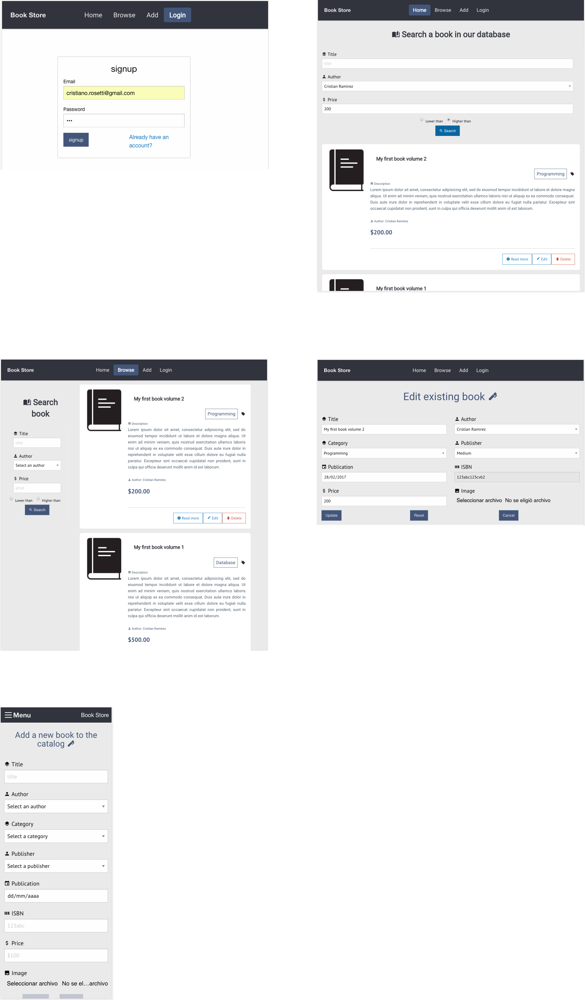

# Book Store Management MEAN Stack example

> - A book store management with CRUD operations calls to an API Service

> - MongoDB database interactions

> - http/2 server enabled

> - User authentication enabled

> - Responsive web design

#### Preview


### Stack
- NodeJS 7.7.0 (installed - required)
- MongoDB 3.4.2
- Angular 2.4 with CLI
- Docker 1.13.1 (installed - required)

## Installation
OS X & Linux:
```sh
$ bash < kraken.sh
```
Windows:
```sh
change linux commands from the kraken.sh file to be able to automate the process
```

---
## Usage of the system with docker

#### !IMPORTANT

before starting to deploy our services either in production mode or development mode, we must check and verify the api url, from the angular *api.service.ts* to be the same ip that the *docker-machine-ip*

#### Get the docker-machine ip
First of all we need to know what is the ip of our docker-machine to get the ip we need to execute the following command:

`$ docker-machine ip dimtec`

---
### Description of usage
**Web App**:

To use the web app we need to visit the following url:
`https://{{docker-machine-ip}}:8080` in a chrome browser for better experience, the browser will ask us if we want to trust the certificate and we need trust it, this happens because we are using self-signed certificates.

In the section where an image is uploaded it uses a fake cdn server to simulate how the image is going to be uploaded and when its uploaded, returns the fake image url, and we update our book object to store the book information on the database.

**Book Service API**

The web app will make use of the API calling the following url: `https://{{docker-machine-ip}}:3000` and here the will the dispatch all the requests need it for, searching, creating, editing, deleting a book, as well as the author.

**MongoDB Database**

To make use of the database the book service api calls the following ip server: `{{docker-machine-ip}}:27017` but to be able to perform the database operations we need to be authenticated.

---
## Usage of the system without docker
## Development setup

**Angular app**

To run the angular app we need to position it in the client folder and run the following command:

```
$ npm start
```

This will run the `angular-cli` command `ng serve` that will deploy the angular app in a webpack integrated server for testing at the url `http://localhost:4200`.

**Server API**

To start the server api, we need to be position it at the server folder and run the command:

```
$ npm start
```

this will start the api service at the following url: `http://localhost:3000`

**Database**

The database will be configured automatically with the script located at the database folder and will be listening at the following url: `{{docker-machine-ip}}:27017`

---
#### Preview

